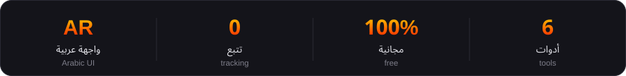
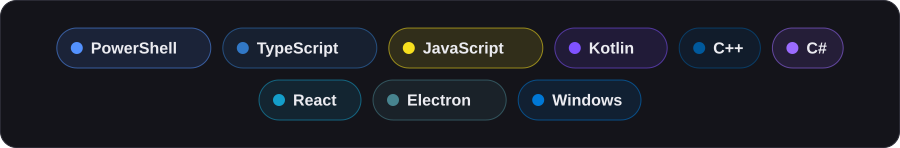

  

  
  

  

<h2 align="center">⚡ أدوات بلازما · Blazma Tools</h2>

  
  

  
  

  
  

<h2 align="center">🛠️ التقنيات · Tech</h2>

  

  كل أدوات بلازما مجانية، بدون حسابات وبدون تتبع · All Blazma tools are free, with no accounts and no tracking

